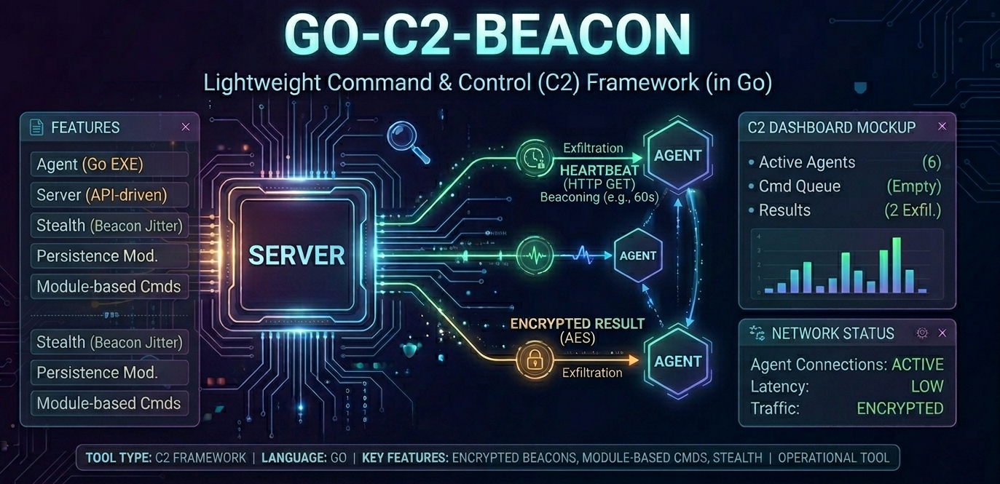

<p align="center">

</p>

# Go-C2-Beacon
Go-C2-Beacon is a lightweight, stealth-focused Command & Control (C2) framework written in Go (Golang). It is designed for security researchers and Red Team practitioners to demonstrate beaconing mechanisms, encrypted communication channels, and operational security (OPSEC) in a simulated environment.

# 🎯 Project Overview
In a modern Red Teaming engagement, maintaining a stealthy communication channel with a compromised host is critical. **Go-C2-Beacon** implements a minimalist agent-server architecture using HTTP/S with built-in encryption and traffic randomization to bypass basic network monitoring solutions.

# Features
- **Golang Powered:** Highly portable, statically linked binaries that are difficult to signature-base detect.
- **AES-256-GCM Encryption:** All communications (commands and results) are encrypted end-to-end.
- **Stealth Beaconing (Jitter):** Implements randomized sleep intervals to break "heartbeat" patterns and evade traffic analysis.
- **Minimalist Agent:** Designed to have a tiny footprint on the target system.
- **Modular Command Execution:** Easily extendable to support file exfiltration, persistence, or lateral movement modules.

# 🏗️ Architecture
1.  **Server (Command Center):** A Python or Go-based listener that manages the command queue and decrypts incoming agent data.
2.  **Agent (The Beacon):** A Go-based executable that checks in periodically to fetch and execute encrypted tasks.

# 🛠️ Technical Details
# Traffic Obfuscation
The agent mimics legitimate browser traffic by utilizing custom HTTP headers and randomized check-in intervals. This simulates real-world adversary behavior where consistency is avoided.

# Cryptography
Every packet sent over the wire is encrypted using **Advanced Encryption Standard (AES) in Galois/Counter Mode (GCM)**, ensuring both confidentiality and authenticity of the commands.


# Prerequisites
- Go 1.20+
- A Linux/Windows environment for testing

# Installation & Usage
```
1. Clone the repository:
git clone https://github.com/ikpehlivan/go-c2-beacon
cd go-c2-beacon

2. Initialize modules:
Bash
go mod init Go-C2-Beacon

3. Run the Server:
Bash
go run server/main.go

4. Run the Agent:
Bash
go run agent/main.go
```

# ⚖️ Ethical Use & Disclaimer
Go-C2-Beacon is created for educational and authorized security assessment purposes only. Unauthorized access to computer systems is illegal. The developer is not responsible for any misuse or damage caused by this tool. Always ensure you have explicit, written consent before performing any security testing.
- Developed by İlteriş Kaan Pehlivan | Pentester | White Hat Hacker | Security Researcher
